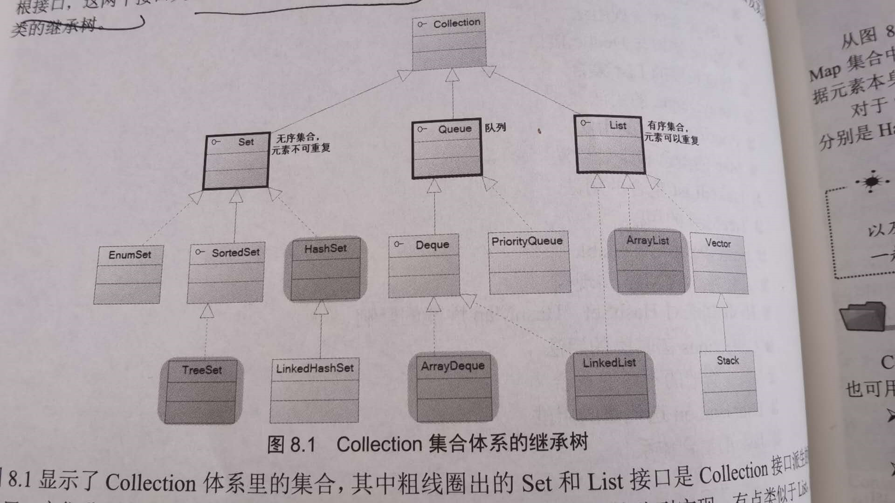

# 1.集合介绍

1. Java 集合大致分为Set，List,Queue和Map四种体系
   1. Set代表不重复，无序的集合
   2. List代表有序，重复的集合
   3. Map代表映射
   4. Queue代表一种队列的集合

2. 所有的集合类都位于java.util包下，后来为了支持线程安全机制，Java5还在java.util.concurrent包下提供了一些多线程集合类

3. Java集合与数组的区别

   数组中可以保存集合基本数据类型，也可以保存对象的引用（习惯上称为对象），而集合只能保存对象的引用（习惯上称为对象）

4. Java的集合类主要由两个接口派生出来：Collection和Map类，Collection和Map是Java集合框架的根接口，这两个接口又包含了一些子接口或实现类

上图中国Set和List接口是Collection接口派生出的两个子接口，他们分别代表无序集合和有序的集合，Queue是Java提供的队列实现，类似于List

5. Map保存的每一项数据都是key-value对，也就是由key和value两个值组成。Map里面的key是不可重复的，key用于标识集合里的每项数据,Set集合无法记住添加这个元素的顺序，所以Set里的元素不能重复（既然没有顺序，就不能重复否则无法识别这个元素），List非常像一个数组，它可以记住每次添加元素的顺序，且List长度是可变的。
6. 如果访问List集合中的元素，可以直接根据元素的索引来访问；如果访问Map集合中的元素，可以根据每项元素的key来访问其value值；如果访问Set集合中的元素，则只能根据元素的本身来访问


# 2. Java11增强的Collection和Iterator接口

## 1介绍

1. Collection接口是List，Set和Iterator接口
   1. boolean add(Object o):该方法用于向集合中添加一个元素。如果集合对象被添加操作改变了，则返回true。
   2. boolean addAll(Collection c)：该方法把集合c中的所有元素添加到指定的集合里。如果集合对象被添加操作改变了，则返回true。
   3. void clear():清除集合里的所有元素，将集合长度变为0.
   4. boolean contains(Object o)返回集合里是否包含指定的元素
   5. boolean containsAll(Collection c):返回结合里是否包含集合c里所有的元素
   6. boolean isEmpty():返回集合是否为空。当集合长度为0时返回true,否则返回false
   7. Iterator iterator() ：返回一个Iterator对象，用于遍历集合里的元素
   8. boolean remove(Object o)删除集合中的指定元素o,当集合中包含了一个或者多个元素o的时候，该方法只删除第一个符合条件的元素，该方法将返回true
   9. boolean removeAll(Collection c）：从集合中删除集合c里包含的元素，如果删除一个或者一个以上的元素，则该方法返回true
   
   10. boolean retainAll(Collection c):从集合中删除集合c里不包含的元素（相当于把调用该方法的集合变成该集合和结合c的交集），如果该操作改变了调用该方法的集合，则该方法返回true
   11. int size():该方法返回集合里元素的个数
   12. Object[] toArray():该方法把集合转换成一个数组，所有的集合元素变成对应的数组元素

```Java
var c=new ArrayList();
c.add("孙悟空");
c.add(6);
System.out.println("c集合的元素个数为："+c.size());
c.remove((Integer)6);
System.out.println("c集合的元素个数为："+c.size());
System.out.println("是否包含孙悟空"+c.contains("孙悟空"));
System.out.println("是否包含6"+c.contains(6));
c.add("java ee企业应用实践");
System.out.println(c);
System.out.println("===================");
var books=new HashSet();
books.add("java ee企业应用实践");
books.add("疯狂javaee讲义");
System.out.println("是否包含books中所有的元素"+c.containsAll(books));
c.removeAll(books);
System.out.println(c);
c.clear();
books.retainAll(c);
System.out.println("books元素的集合"+books);
```

传统的模式下将一个对象丢进集合，集合会忘记这个对象的类型，也就是说全部当做Object类型，但是jdk1.5后就改进了，可以使用泛型来限制集合里元素的类型。

Java11为Collection新增了一个toArray(IntFunction)方法，使用该方法的主要目的就是利用泛型，但对于传统的toArray而言，不管Collection本身是否使用泛型，toArray()的返回值总是Object[]；但是新增的toArray不同，当使用Collection使用泛型的时候，toArray可以返回特定的类型数组

```Java
 //该Collection使用了泛型，指定它的集合元素是String
var StrColl= List.of("Java","Kotlin","Swift","Python");
//toArray()方法参数是一个lambda表达式，代表IntFunction对象
 //toArray()方法的返回值类型是String[] 而不是Object[]
String[] aa=StrColl.toArray(String[]::new);
System.out.println(Arrays.toString(aa));
```

由于使用该方法的主要目的就是利用泛型，因此toArray(IntFunction)方法参数通常就是它要返回的数组类型后面加双引号和new(构造器引用)

## 2.使用Lambda表达式遍历集合

1. Java8为Iterable接口新增了一个forEach(Consumer action)默认方法，该方法所需要的参数的类型是一个函数式的接口，而Iterable接口是Collection接口的父接口，因此Collection集合也可以直接调用该方法。当程序调用Iterable的forEach(Consumer action)遍历集合元素的时候，程序会依次将结合元素传给Consumer的accep(T t)方法（该接口中唯一的抽象方法）。正因为Consumer是函数式的接口，因此可以使用lambda表达式来遍历集合元素。

   ```Java
   var books=new HashSet();
   books.add("轻量级JavaEE企业应用实践");
   books.add("疯狂Java讲义");
   books.add("疯狂Android讲义");
   books.forEach(obj->System.out.println("迭代集合元素："+obj));
   ```

上面程序中粗体字代码调用了Iterable的forEach()默认方法来遍历集合元素，传给该方法的参数是Lambda表达式，该Lambda表达式的目标类型是Consumer。forEach()方法会自动的将结合元素逐个的传给Lambda表达式的形参，这样Lambda表达式就可以遍历集合元素了.

## 3. 使用iterator遍历集合元素

1. Iterator主要用来遍历对象，也被称为兑现迭代器
2. Iterator接口中定义了如下4个方法
   * boolean hasNext():如果迭代的集合元素没有被遍历完，则返回true
   * Object next()：返回集合中的下一个元素
   * void remove()：删除集合上一次next方法返回的元素
   * void forEachRemaining(Consumer action)：这是Java8为Iterator新增的默认方法

```Java
// 创建集合、添加元素的代码与前一个程序相同
var books = new HashSet();
books.add("轻量级Java EE企业应用实战");
books.add("疯狂Java讲义");
books.add("疯狂Android讲义");
// 获取books集合对应的迭代器
var it = books.iterator();
while (it.hasNext())
{
    // it.next()方法返回的数据类型是Object类型，因此需要强制类型转换
    var book = (String) it.next();
    System.out.println(book);
    if (book.equals("疯狂Java讲义"))
    {
        // 从集合中删除上一次next方法返回的元素
        it.remove();
    }
    // 对book变量赋值，不会改变集合元素本身
    book = "测试字符串";   // ①
}
System.out.println(books);
```

Iterator必须依附于Collection对象，若有一个Iterator对象，则必然有一个与之关联的Collection对象，Iterator提供了两个方法迭代访问Collection集合里的元素，并可通过remove方法删除集合中上一次next()方法返回的集合元素

上面可以看到Iterator并不是把集合元素本身传给了迭代变量，而是把集合元素的值传给了迭代变量，所以修改迭代变量的值 对集合没有任何影响

3. 当正在使用Iterator迭代访问Collection的时候，Collection集合里的元素不能改变，只有通过Iterator里的remove()方法删除上一次next()方法返回的集合元素才可以；否则将会引发java.util.ConcurrentModificationException异常

   ```Java
   // 创建集合、添加元素的代码与前一个程序相同
   var books = new HashSet();
   books.add("轻量级Java EE企业应用实战");
   books.add("疯狂Java讲义");
   books.add("疯狂Android讲义");
   // 获取books集合对应的迭代器
   var it = books.iterator();
   while (it.hasNext())
   {
       // it.next()方法返回的数据类型是Object类型，因此需要强制类型转换
       var book = (String) it.next();
       System.out.println(book);
       if (book.equals("疯狂Java讲义"))
       {
           // 从集合中删除上一次next方法返回的元素
           it.remove();
       }
       // 对book变量赋值，不会改变集合元素本身
       books.remove(book);//将会触发异常
   }
   System.out.println(books);
   ```

   但删除某个特定元素的时候是可以的，但程序员不应该这么做

## 4. 使用lambda表达式遍历Iterator

```Java
// 创建集合、添加元素的代码与前一个程序相同
var books = new HashSet();
books.add("轻量级Java EE企业应用实战");
books.add("疯狂Java讲义");
books.add("疯狂Android讲义");
// 获取books集合对应的迭代器
var it = books.iterator();
// 使用Lambda表达式（目标类型是Comsumer）来遍历集合元素
it.forEachRemaining(obj -> System.out.println("迭代集合元素：" + obj));
```

上面的程序中代码调用了Iterator的forEachRemaining()方法来遍历集合元素，传给该方法的参数是一个Lambda表达式，该Lambda表达式目标类型是Consumer

## 5. 使用foreach循环遍历集合元素

```Java
// 创建集合、添加元素的代码与前一个程序相同
        var books = new HashSet();
        books.add(new String("轻量级Java EE企业应用实战"));
        books.add(new String("疯狂Java讲义"));
        books.add(new String("疯狂Android讲义"));
        for (var obj : books)
        {
            // 此处的book变量也不是集合元素本身
            var book = (String) obj;
            System.out.println(book);
//            if (book.equals("疯狂Android讲义"))
//            {
//                // 下面代码会引发ConcurrentModificationException异常
//                books.remove(book);     // ①
//            }
        }
        System.out.println(books);
```

## 6.使用Predicate操作集合

Java8为Collection集合新增了一个removeIf(Predicate filter)方法，该方法将会批量删除符合filter条件的所有元素。该方法需要一个Predicate对象作为参数，Predicate也是函数式接口，因此可以使用Lambda表达式作为参数。

```Java
var books=new HashSet();
books.add("轻量级Java EE企业应用实践");
books.add("疯狂Java讲义");
books.add("疯狂IOS讲义");
books.removeIf(ele->((String) ele).length()<10);
System.out.println(books);
```

使用Predicate可以充分简化集合的运算，假设依然有上面的程序集合，如果有如下三个要求：

* 统计书名中出现“疯狂”字符串的图书数量

* 统计书名中出现‘Java’字符串图书是数量

* 统计书名中长度大于10的图书的数量

  ```Java
  public static void main(String[] args){
      // 创建books集合、为books集合添加元素的代码与前一个程序相同。
      var books = new HashSet();
      books.add("轻量级Java EE企业应用实战");
      books.add("疯狂Java讲义");
      books.add("疯狂iOS讲义");
      books.add("疯狂Ajax讲义");
      books.add("疯狂Android讲义");
      // 统计书名包含“疯狂”子串的图书数量
      System.out.println(calAll(books, ele->((String) ele).contains("疯狂")));
      // 统计书名包含“Java”子串的图书数量
      System.out.println(calAll(books, ele->((String) ele).contains("Java")));
      // 统计书名字符串长度大于10的图书数量
      System.out.println(calAll(books, ele->((String) ele).length() > 10));
  }
  public static int calAll(Collection books, Predicate p)
  {
      int total = 0;
      for (var obj : books)
      {
          // 使用Predicate的test()方法判断该对象是否满足Predicate指定的条件
          if (p.test(obj))
          {
              total++;
          }
      }
      return total;
  }
  ```

  

##  7.使用Stream操作集合

1. Java8新增了Stream，IntStream，LongStream,DoubleStream等流式API，这些API代表多个支持串行和并行的的聚集操作的元素，上面的接口中Stream是一个通用地方流式接口，而IntStream,LongStream，DoubleStream则代表元素类型为int,long,double的流

2. Java8还为上面每个流式API提供了对应的Builder，例如Stream.Builder,IntStream.Builder,LongStream.Builder,DoubleStream.Builder

3. 独立使用Stream的步骤如下：

   * 使用Stream或XxxStream的builder()类方法创建该Stream的Builder

   * 重复调用Builder的add()方法像该流中添加多个元素

   * 调用Builder的build()方法获取对应的Stream

   * 调用Stream的聚集方法

     ```Java
      var is= IntStream.builder()
                    .add(20)
                    .add(13)
                    .add(-2)
                    .add(18)
                    .build();
     //       System.out.println("最大"+is.max().getAsInt());//1
     //       System.out.println("最小"+is.min().getAsInt());//2
     //       System.out.println("总和"+is.sum());//3
     //       System.out.println("总数"+is.count());//4
     //       System.out.println("所有元素的平方都大于20"+is.allMatch(ele ->ele*ele>20));
     //       System.out.println("是否包含任何元素的平方都大于20"+is.anyMatch(ele->ele*ele>20));
     //       //将is映射成一个新的Stream,新的Stream的每个元素是原Stream的2倍+1
            var newIs=is.map(ele->ele*2+1);
            //使用方法引用的方式来遍历集合
             newIs.forEach(System.out::println);
     ```

上面注释掉的代码每次只能执行一行，否则会抛出异常

8. 中间方法：中间方法允许流保持打开，并允许直接调用后续的方法。上面程序中的map()方法就是中间方法。中间方法返回值是另外一个流
9. 末端方法：末端方法是对流的最终操作。当对某个Stream执行末端方法后，该流将会被消耗其不可再用。上面程序中sum(),count(),average()等方法都是末端的方法
10. 有状态方法：这种方法会给流增加一些新的属性，比如元素的唯一属性，元素的最大数量，保证元素以排序的方式被处理等，有状态的方法往往需要更大的性能开销
11. 短路方法：短路方法可以尽早结束对流的操作，不必检查所有元素
12. 下面介绍一下Stream常用的中间方法
    1. filter(Predicate predicate)：过滤Stream中所有不符合predicate的元素
    2. mapToXxx(ToXxxFunction mapper):使用ToXxxFunction 对流中的执行一对一的转换，该方法返回的新流中包含了ToXxxFunction转换生成的所有元素
    3. peek(Consumer action)：依次对每个元素执行一些操作，该方法返回的流与原有流中包含相同的元素，主要用于调试。
    4. distinct():该方法用于排序流中搜友重复的元素（判断元素重复的标准是使用equals()比较返回true）.这是一个有状态的方法
    5. sorted():该方法哟用于保证流中元素在后续的访问中处于有序状态。这是一个有状态的方法
    6. limit(long maxSize):该方法用于保证对流的后续访问中最大允许访问的元素的个数，这是一个有状态的，短路方法

下面介绍下Stream常用的末端方法

1. forEach(Consumer action):遍历流中所有的元素，对每个元素执行action

2. toArray():将流中所有元素转换成一个数组

3. reduce():该方法有三个重载的版本,都用于通过某种操作来合并流中的元素

4. min():返回流中所有元素的最小值

5. max():返回流中所有元素的最大值

6. count()：返回流中所有元素的数量

7. anyMatch（Predicate predicate）:判断流中是否至少包含一个元素符合Predicate条件

8. allMatch(Predicate predicate):判断流中是否每个元素都符合Predicate条件

9. findFirst()：返回流中的第一个元素

10. findAndy()：返回流中任意一个元素

    ```Java
    // 创建books集合、为books集合添加元素的代码与8.2.5小节的程序相同。
    var books = new HashSet();
    books.add("轻量级Java EE企业应用实战");
    books.add("疯狂Java讲义");
    books.add("疯狂iOS讲义");
    books.add("疯狂Ajax讲义");
    books.add("疯狂Android讲义");
    // 统计书名包含“疯狂”子串的图书数量
    System.out.println(books.stream()
            .filter(ele->((String) ele).contains("疯狂"))
            .count()); // 输出4
    // 统计书名包含“Java”子串的图书数量
    System.out.println(books.stream()
            .filter(ele->((String) ele).contains("Java") )
            .count()); // 输出2
    // 统计书名字符串长度大于10的图书数量
    System.out.println(books.stream()
            .filter(ele->((String) ele).length() > 10)
            .count()); // 输出2
    // 先调用Collection对象的stream()方法将集合转换为Stream,
    // 再调用Stream的mapToInt()方法获取原有的Stream对应的IntStream
    books.stream().mapToInt(ele -> ((String) ele).length())
            // 调用forEach()方法遍历IntStream中每个元素
            .forEach(System.out::println);// 输出8 11 16 7 8
    ```

    